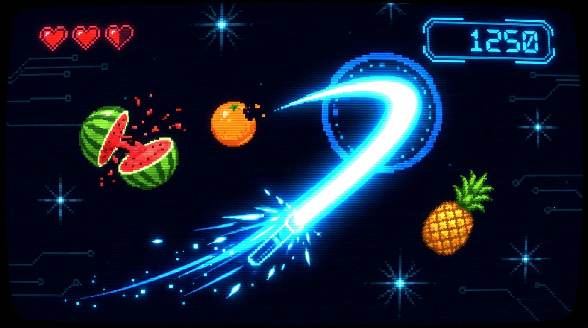
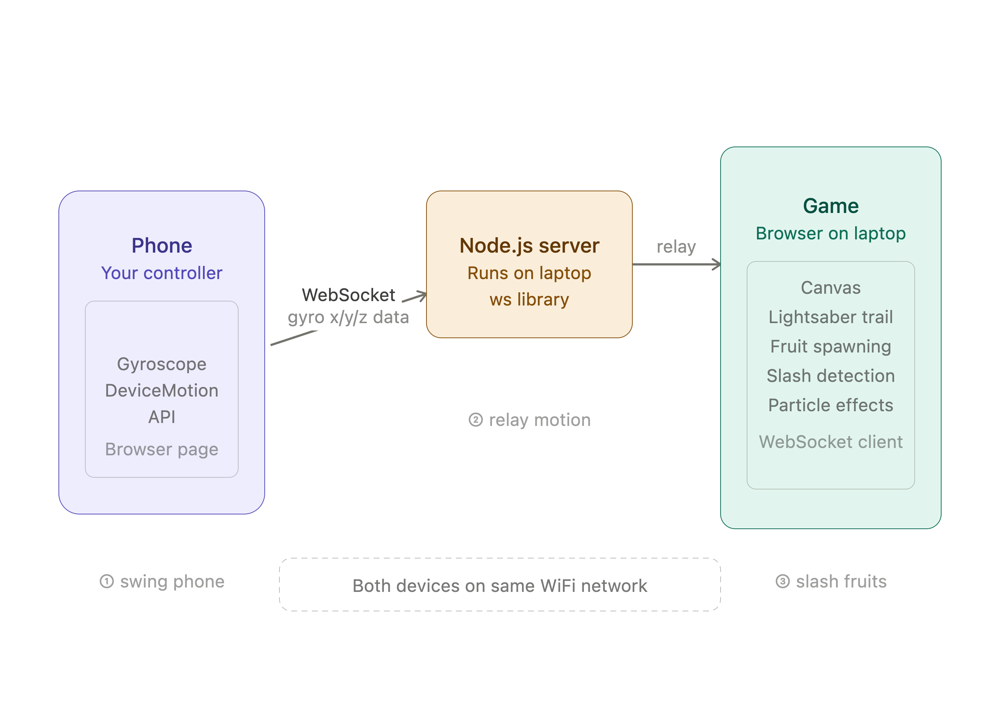
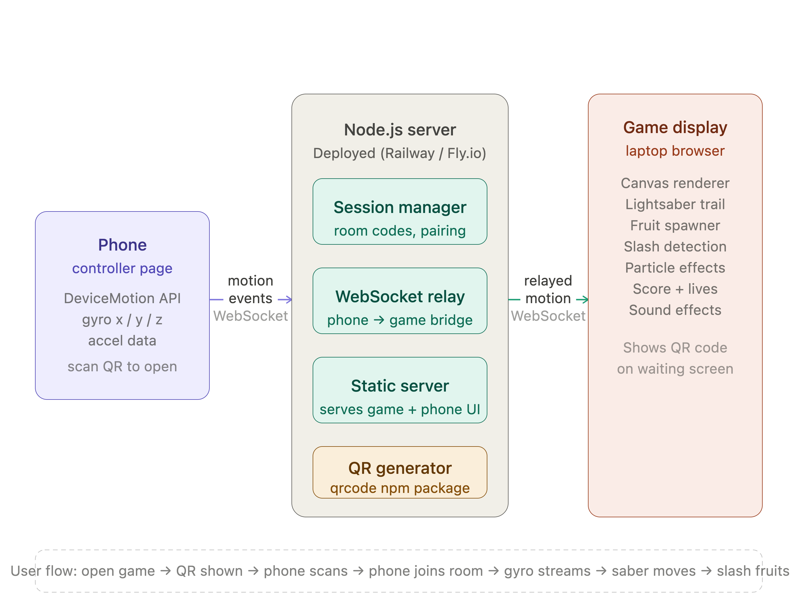

# fruits.wtf

> A motion-controlled browser game — scan a QR code on your phone, swing it like a lightsaber, and slash falling fruits on screen.


---

## How it works

Open the game on any screen. A QR code appears. Scan it with your phone. The game starts — tilt and swing your phone to move the lightsaber and slice everything in sight.

No app install. No accounts. Just a URL and a Phone.



---

## Architecture

The system has three pieces: a phone controller, a Node.js relay server, and the game canvas running in the laptop browser. They communicate over WebSockets, paired by a 6-character room code embedded in the QR.

### System overview




### Phone → server → game data flow



---

## Tech stack

| Layer | Technology |
|---|---|
| Server | Node.js + Express + `ws` |
| QR code | `qrcode` npm package |
| Game engine | Vanilla JS, HTML5 Canvas |
| Phone input | `DeviceMotionEvent` / `DeviceOrientationEvent` |
| Deployment | Railway or Fly.io (HTTPS required for gyro) |
| Real-time | WebSockets, ~60 events/sec |

---

## Project structure

```
fruits-wtf/
├── server.js              # Express + WebSocket server, room management
├── package.json
└── public/
    ├── game.html          # Laptop game screen (shows QR, runs canvas)
    ├── game.js            # Canvas engine, saber trail, fruit physics
    ├── controller.html    # Phone page (opened by QR scan)
    └── controller.js      # DeviceMotion → WebSocket stream
```

---

## Getting started

### Run locally

```bash
git clone https://github.com/ungaaaabungaaa/Saber-Fruits.git
cd Saber-Fruits
npm install
node server.js
```

Open `http://localhost:3000` on your laptop. The QR code will appear. Scan it with your phone — **your phone and laptop must be on the same network**, or you must use a public deployment so your phone can reach the server over the internet.

> **iOS note:** DeviceMotion requires HTTPS. For local dev, use `ngrok http 3000` and open the ngrok URL on your laptop instead.

### Deploy to Railway

```bash
npm install -g @railway/cli
railway login
railway init
railway up
```

Set the `PORT` environment variable if needed (Railway sets it automatically). Once deployed, both laptop and phone connect to the same public HTTPS URL — no local network required.

### Deploy to AWS EC2

If you have AWS free-tier credits/access, the simplest AWS path is a small EC2 instance running Docker. This works well for fruits.wtf because the server is a normal long-running Node.js process with WebSockets.

AWS references:

- [Get started with Amazon EC2](https://docs.aws.amazon.com/AWSEC2/latest/UserGuide/EC2_GetStarted.html)
- [Elastic IP addresses](https://docs.aws.amazon.com/AWSEC2/latest/UserGuide/elastic-ip-addresses-eip.html)
- [Caddy reverse proxy](https://caddyserver.com/docs/quick-starts/reverse-proxy)
- [Caddy automatic HTTPS](https://caddyserver.com/docs/automatic-https)

#### 1. Launch the instance

In the EC2 console:

1. Launch an Ubuntu or Amazon Linux instance.
2. Choose a Free Tier eligible instance type if your account has free-tier eligibility or credits.
3. Create/download a key pair.
4. Security group inbound rules:
   - SSH `22` from your own IP only.
   - HTTP `80` from anywhere.
   - HTTPS `443` from anywhere.
5. Do not expose port `3000` publicly. Caddy will proxy public HTTPS traffic to the app.

> AWS public IPv4 and Elastic IP pricing can change and may not be fully free. Check billing/free-tier usage before leaving instances running.

#### 2. Point your domain at EC2

iPhone motion needs HTTPS, so use a real domain.

Create an `A` record at your DNS provider:

```text
fruits.wtf -> EC2 public IPv4 address
```

Using an Elastic IP makes the address stable, but AWS may charge for public IPv4 addresses. If you skip Elastic IP, your public IP can change when the instance stops/starts.

#### 3. Install Docker on the EC2 instance

SSH into the instance, then install Docker.

Ubuntu:

```bash
sudo apt update
sudo apt install -y git docker.io
sudo systemctl enable --now docker
sudo usermod -aG docker $USER
newgrp docker
```

Amazon Linux:

```bash
sudo yum update -y
sudo yum install -y git docker
sudo systemctl enable --now docker
sudo usermod -aG docker $USER
newgrp docker
```

#### 4. Build and run fruits.wtf

```bash
git clone https://github.com/ungaaaabungaaa/Saber-Fruits.git
cd Saber-Fruits
docker build -t fruits-wtf .
docker network create fruits-wtf-net
docker run -d \
  --name fruits-wtf \
  --network fruits-wtf-net \
  --restart unless-stopped \
  fruits-wtf
```

#### 5. Add HTTPS with Caddy

Replace `fruits.wtf` if you use a different domain.

```bash
mkdir -p ~/caddy/data ~/caddy/config
cat > ~/Caddyfile <<'EOF'
fruits.wtf {
  reverse_proxy fruits-wtf:3000
}
EOF

docker run -d \
  --name fruits-wtf-caddy \
  --network fruits-wtf-net \
  --restart unless-stopped \
  -p 80:80 \
  -p 443:443 \
  -v ~/Caddyfile:/etc/caddy/Caddyfile \
  -v ~/caddy/data:/data \
  -v ~/caddy/config:/config \
  caddy:2
```

Open:

```text
https://fruits.wtf/game
```

Caddy automatically requests and renews HTTPS certificates when DNS points to the instance and ports `80`/`443` are open.

#### 6. Update after new commits

```bash
cd Saber-Fruits
git pull
docker build -t fruits-wtf .
docker rm -f fruits-wtf
docker run -d \
  --name fruits-wtf \
  --network fruits-wtf-net \
  --restart unless-stopped \
  fruits-wtf
```

---

## How the pairing works

```
1. Laptop opens /             → server creates room "XK92PL"
2. Server renders QR          → encodes https://yoursite.com/controller?room=XK92PL
3. Phone scans QR             → opens controller page
4. Phone requests permission  → iOS prompts for motion access
5. Phone joins room           → WebSocket message: { type: "join-controller", roomId: "XK92PL" }
6. Server pairs them          → notifies game: { type: "controller-connected" }
7. Game starts                → phone streams { alpha, beta, gamma } at ~60fps
8. Server relays              → game maps beta→Y, gamma→X, moves saber
```

---

## Controls

| Motion | Action |
|---|---|
| Tilt left / right | Move saber horizontally (`gamma`) |
| Tilt forward / back | Move saber vertically (`beta`) |
| Swing fast | Longer saber trail, more dramatic slashes |
